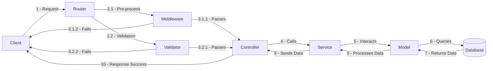

# RESTful API Architecture

## Architecture Overview

- **Router**: Handles incoming requests and routes them to the correct controller.
- **Middleware**: Pre-process the request before it reaches the controller.
- **Validator**: Checks incoming request data to ensure it meets expected rules before processing it.
- **Controller**: Calls the service layer and handles request-response logic.
- **Service**: Contains business logic and interacts with the model layer.
- **Model**: Defines the database schema and handles database queries.
- **Database**: Stores application data.

## URL Naming Convention

For example, you're naming a Resource Management API, version 1:

- **GET**: `/v1/resoure` -> get all resources
- **GET**: `/v1/resoure/:resoure_id` -> get specific resource
- **POST**: `/v1/resoure/` -> create new resource
- **PUT**: `/v1/resoure/:resoure_id` -> update existed resource
- **DELETE**: `/v1/resoure/:resoure_id` -> delete specific resource

## Files naming convention

- **Route**: `resource.route.js`
- **Controller**: `resource.controller.js`
- **Middleware**: `resource.middleware.js`
- **Validator**: `resource.validator.js`
- **Services**: `resource.service.js`
- **Models**: `resource.model.js`
