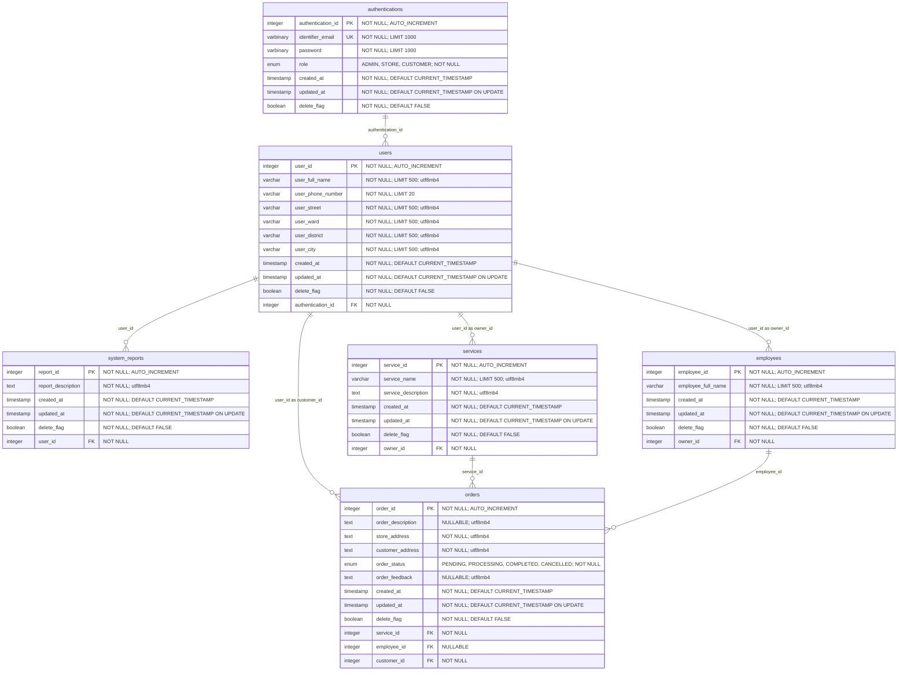

# Database Schema

Below is the ER diagram for the database schema:

```mermaid
erDiagram
    authentications ||--o{ users : "authentication_id"
    users ||--o{ system_reports : "user_id"
    users ||--o{ employees : "user_id as owner_id"
    users ||--o{ services : "user_id as owner_id"
    users ||--o{ orders : "user_id as customer_id"
    services ||--o{ orders : "service_id"
    employees ||--o{ orders : "employee_id"

    authentications {
        integer authentication_id PK "NOT NULL; AUTO_INCREMENT"
        varbinary identifier_email UK "NOT NULL; LIMIT 1000"
        varbinary password "NOT NULL; LIMIT 1000"
        enum role "ADMIN, STORE, CUSTOMER; NOT NULL"
        timestamp created_at "NOT NULL; DEFAULT CURRENT_TIMESTAMP"
        timestamp updated_at "NOT NULL; DEFAULT CURRENT_TIMESTAMP ON UPDATE"
        boolean delete_flag "NOT NULL; DEFAULT FALSE"
    }

    users {
        integer user_id PK "NOT NULL; AUTO_INCREMENT"
        varchar user_full_name "NOT NULL; LIMIT 500; utf8mb4"
        varchar user_phone_number "NOT NULL; LIMIT 20"
        varchar user_street "NOT NULL; LIMIT 500; utf8mb4"
        varchar user_ward "NOT NULL; LIMIT 500; utf8mb4"
        varchar user_district "NOT NULL; LIMIT 500; utf8mb4"
        varchar user_city "NOT NULL; LIMIT 500; utf8mb4"
        timestamp created_at "NOT NULL; DEFAULT CURRENT_TIMESTAMP"
        timestamp updated_at "NOT NULL; DEFAULT CURRENT_TIMESTAMP ON UPDATE"
        boolean delete_flag "NOT NULL; DEFAULT FALSE"
        integer authentication_id FK "NOT NULL"
    }

    system_reports {
        integer report_id PK "NOT NULL; AUTO_INCREMENT"
        text report_description "NOT NULL; utf8mb4"
        timestamp created_at "NOT NULL; DEFAULT CURRENT_TIMESTAMP"
        timestamp updated_at "NOT NULL; DEFAULT CURRENT_TIMESTAMP ON UPDATE"
        boolean delete_flag "NOT NULL; DEFAULT FALSE"
        integer user_id FK "NOT NULL"
    }

    employees {
        integer employee_id PK "NOT NULL; AUTO_INCREMENT"
        varchar employee_full_name "NOT NULL; LIMIT 500; utf8mb4"
        timestamp created_at "NOT NULL; DEFAULT CURRENT_TIMESTAMP"
        timestamp updated_at "NOT NULL; DEFAULT CURRENT_TIMESTAMP ON UPDATE"
        boolean delete_flag "NOT NULL; DEFAULT FALSE"
        integer owner_id FK "NOT NULL"
    }

    services {
        integer service_id PK "NOT NULL; AUTO_INCREMENT"
        varchar service_name "NOT NULL; LIMIT 500; utf8mb4"
        text service_description "NOT NULL; utf8mb4"
        timestamp created_at "NOT NULL; DEFAULT CURRENT_TIMESTAMP"
        timestamp updated_at "NOT NULL; DEFAULT CURRENT_TIMESTAMP ON UPDATE"
        boolean delete_flag "NOT NULL; DEFAULT FALSE"
        integer owner_id FK "NOT NULL"
    }

    orders {
        integer order_id PK "NOT NULL; AUTO_INCREMENT"
        text order_description "NULLABLE; utf8mb4"
        text store_address "NOT NULL; utf8mb4"
        text customer_address "NOT NULL; utf8mb4"
        enum order_status "PENDING, PROCESSING, COMPLETED, CANCELLED; NOT NULL"
        text order_feedback "NULLABLE; utf8mb4"
        timestamp created_at "NOT NULL; DEFAULT CURRENT_TIMESTAMP"
        timestamp updated_at "NOT NULL; DEFAULT CURRENT_TIMESTAMP ON UPDATE"
        boolean delete_flag "NOT NULL; DEFAULT FALSE"
        integer service_id FK "NOT NULL"
        integer employee_id FK "NULLABLE"
        integer customer_id FK "NOT NULL"
    }
```
